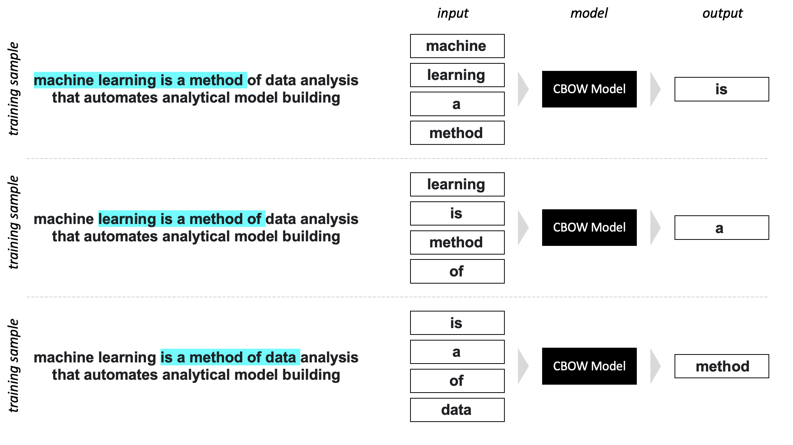
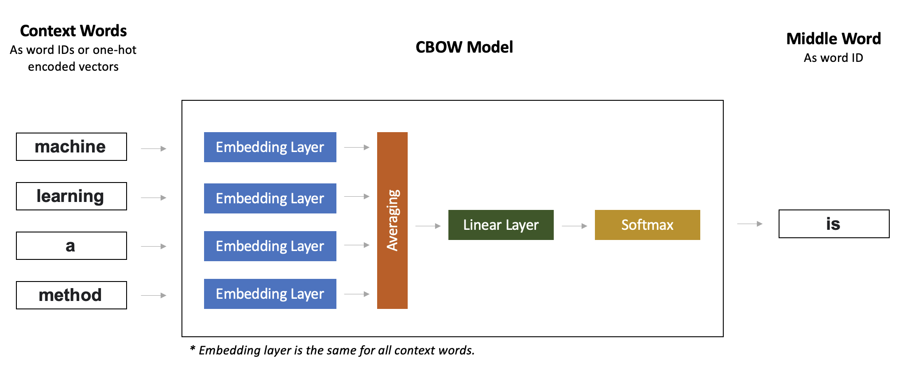
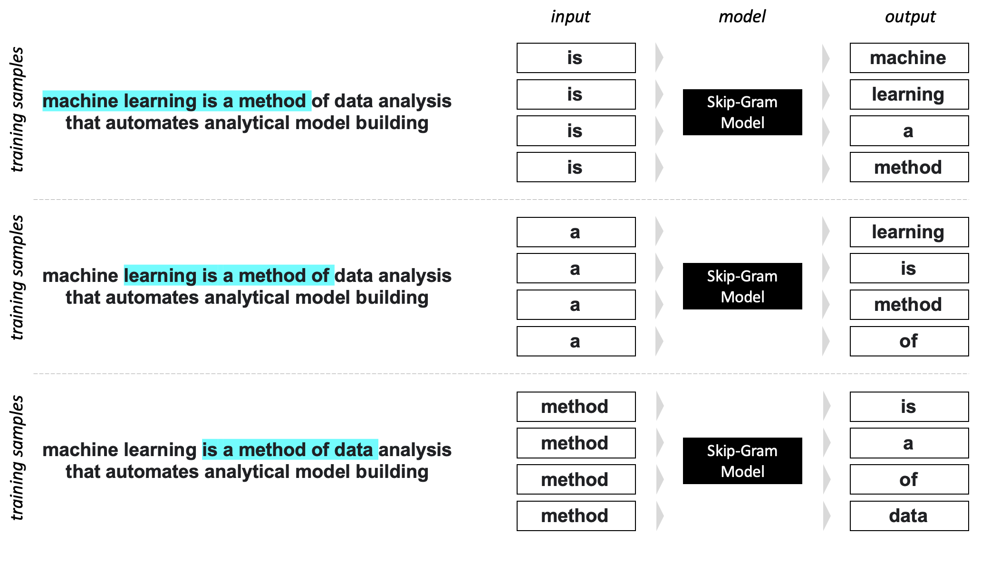

# Word2Vec in PyTorch

Оригинальная статья [Word2vec with PyTorch: Implementing the Original Paper](https://towardsdatascience.com/word2vec-with-pytorch-implementing-original-paper-2cd7040120b0)

Реализация первой статьи по word2vec - [Efficient Estimation of Word Representations in Vector Space](https://arxiv.org/abs/1301.3781).

## Word2Vec Overview

В статье описаны 2 модельные архитектуры::

- Continuous Bag-of-Words Model (CBOW), который предсказывает слово на основе его контекста;
- Continuous Skip-gram Model (Skip-Gram), это предсказывает контекст для слова.

Отличие от оригинальной статьи:

- Обучено на [PennTreebank](https://pytorch.org/text/stable/datasets.html#penntreebank).
- Контекст для обеих моделей представлен в виде 4 предыдущих и 4 будущих слов.
- Для CBOW для контекстных вложений слов использовалось усреднение вместо суммирования.
- Для Skip-Gram все контекстные слова отбираются с одинаковой вероятностью. 
- Простой Softmax использовался вместо иерархического Softmax. Дерево Хаффмана также не использовалось.
- Вместо Adagrad был использован Adam optimizer.
- Обучался в течение 10 эпох.
- Применена регуляризация: нормы вектора встраивания ограничены значением 1.


### CBOW в деталях
#### Высокоуровневая модель

#### Архитектура модели



### Skip-Gram в деталях
#### Высокоуровневая модель

#### Архитектура модели


## Структура проекта


```
.
├── README.md
├── config.yaml
├── notebooks
│   └── practice.ipynb
├── requirements.txt
├── train.py
├── utils_word2vec
│   ├── __init__.py
│   ├── constants.py
│   ├── dataloader.py
│   ├── helper.py
│   ├── model.py
│   └── trainer.py
└── weights

```

- **utils_word2vec/dataloader.py** - data loader для датасета PennTreebank
- **utils_word2vec/model.py** - архитектура моделей
- **utils_word2vec/trainer.py** - класс обучения моделей

- **train.py** - скрипт для обучения
- **config.yaml** - конфиг файл
- **weights/** - директория где хранятся веса обученных моделей и словари
- **notebooks/practice.ipynb** - notebook семинара, с визуализацией и примерами предобработки текста

## Usage


```
python3 train.py --config config.yaml
```

Перед выполнением команды измените параметры обучения в файле config.yaml, наиболее важные из которых:

- model_name ("skipgram", "cbow")
- dataset ("PennTreebank")
- model_dir (директория где хранятся веса обученных моделей и словари, следует начать с "weights/")
- continue_training (директория где уже есть файлы .pt с параметрами модели и словарем для дообучения той же модели, если такой директории нет или она не указана, то создается новая модель)

## License
Этот проект лицензирован в соответствии с условиями [MIT license](https://choosealicense.com/licenses/mit/).
